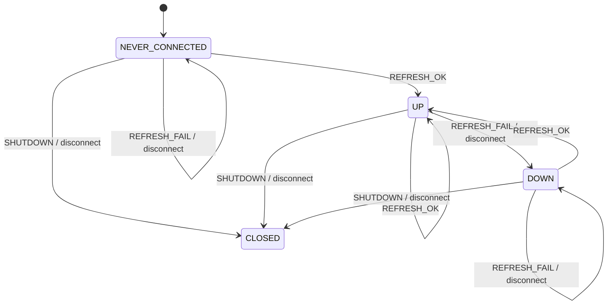
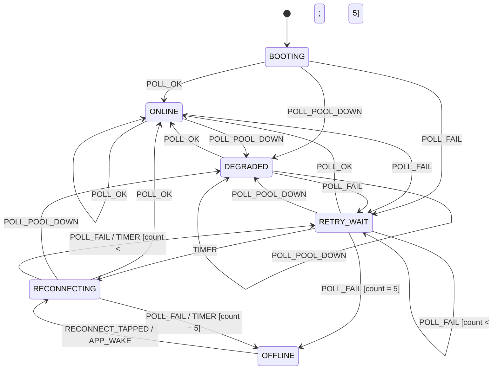
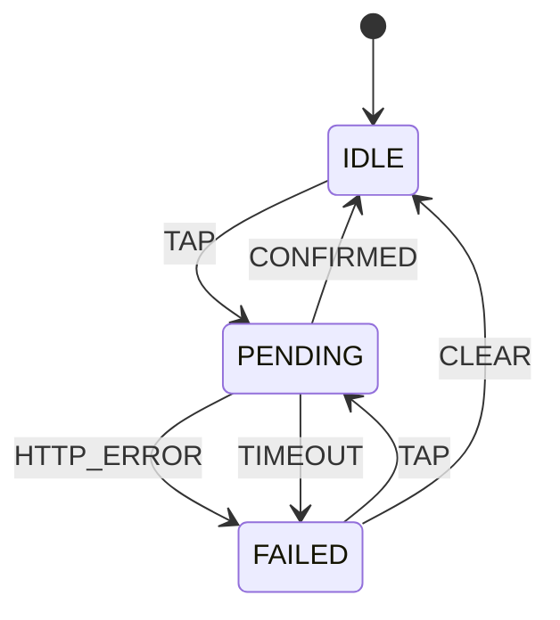
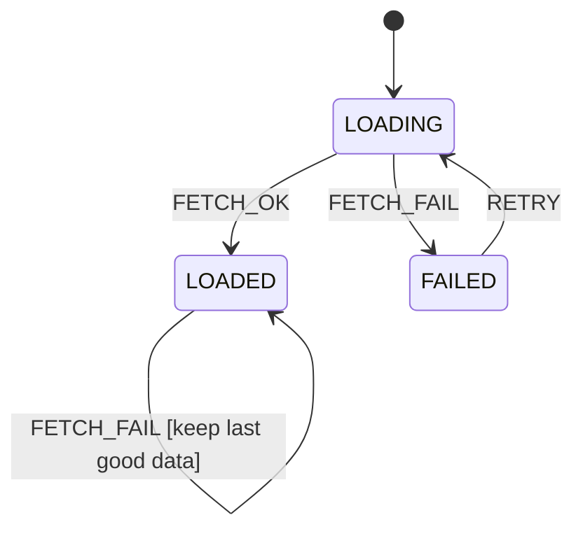

# PoolLogic — Design Document

A family-facing web app for controlling a Pentair pool system over home wifi.
PWA client (HTML/JS, FSM-driven) + thin Python bridge speaking the ScreenLogic
protocol. High-trust home environment: anyone on the wifi may use it.

Decided 2026-07-21 after design discussion. This document is the spec; code
follows it.

---

## 1. System architecture

```
Phones / tablets / laptops        Bridge host (dev PC now,          Pool equipment
                                  turnkey box later)
┌──────────────────────┐  HTTP/JSON  ┌───────────────────────┐  ScreenLogic  ┌─────────┐
│ PoolLogic PWA        │ ──────────> │ bridge.py             │  TCP (1 conn) │ Adapter │──RS-485──> Panel
│ (HTML/JS, FSM+store) │  poll ~5s   │ screenlogicpy+aiohttp │ ────────────> │         │
└──────────────────────┘             │ also serves PWA files │               └─────────┘
                                     └───────────────────────┘
```

**Why a bridge (settled):** Browsers cannot open raw TCP/UDP sockets; the
ScreenLogic adapter speaks only a raw binary TCP protocol with UDP discovery.
Additionally the adapter tolerates only a few concurrent clients (shared with
the official Pentair app), so a single multiplexing connection is correct even
beyond the browser limitation. The official Pentair app needs no bridge because
it is native code with raw socket access — a capability web pages do not have.

**Single origin:** one process, one port. `http://<host>:8080/` serves the PWA
static files; `/api/*` serves JSON. No CORS, one URL for the family.

**Deployment:** develop and run on the dev PC (same wifi as the adapter).
Deployment target decided later; preference is turnkey (e.g., preloaded-SD Pi
kit). Nothing in the design changes between hosts.

**Hosting constraints (settled):** GitHub Pages is not usable — an HTTPS page
cannot make requests to the LAN (mixed content), and GitHub cannot reach the
pool. Files are served from the bridge over plain LAN HTTP. Consequence: no
service worker (requires secure context). Offline caching is worthless for
this app anyway. Manifest + icons are kept so add-to-home-screen gives a real
icon and title on iOS/Android.

**Reference projects:**
- Protocol library: https://github.com/dieselrabbit/screenlogicpy (used by the bridge)
- Protocol documentation: https://github.com/ceisenach/screenlogic_over_ip
- PWA structure model: https://github.com/markcrandall/SimpleShoppingList
- FSM idiom: https://aic-lab.com/systemverilog/FSM/

---

## 2. Feature scope (settled)

| Control | UI | Maps to |
|---|---|---|
| Pool / Spa mode | two-position switch | spa circuit on/off (panel handles valve interlock) |
| Heater | On/Off toggle + setpoint stepper per active body | heat mode Off(0) / Heater(3); SetHeatPoint |
| Spa auto-heat | selecting Spa mode also sends heater-on (spa setpoint); leaving Spa sends heater-off. App-owned so a mid-session Heater-Off sticks. REQUIRES disabling the panel's "Spa Manual Heat" setting (verified 2026-07-22: with it enabled the controller re-asserts heat ~15s after any off command while the spa circuit is on) | app-side, in the mode control's send |
| Setpoint bounds | 40–102 °F, enforced bridge-side; the UI clamp now **reads them from `/api/config`** rather than mirroring the number by hand, so a `config.local.json` override cannot desync the two (M8). Range lowered from 75 on 2026-07-22 to match the pool body's real setpoint range | |
| Heater body | Spa only on `/` (the default); `/?pool` keeps both — see 5.1 for why the old shared view invited heating the pool by accident | one resolver in `viewmode.js` |
| Jets | toggle | jets circuit |
| Cleaner | toggle | cleaner circuit |
| Spillway | toggle | spillway circuit |
| Pool light | toggle | pool light circuit |
| Spa light | toggle | spa light circuit |
| Light show | picker: **White** (non-color) / **Caribbean** / **Party** (added 2026-07-22) | IntelliBrite color command (applies to IntelliBrite lights collectively) |
| Temperatures | read-only banner: air / pool / spa; a water temp renders muted with a "last reading" hint while its body isn't circulating (the controller only measures flowing water, so idle-body temps are frozen at the last circulated reading) | polled; pool circuit (505) is in the payload read-only to drive this |
| Com status | header dot + banners; manual Reconnect when offline | see Connection FSM |

No solar modes, no schedules, no chemistry — out of scope by decision.
Heat control is deliberately "turn on + setpoint / turn off" only.

### Bridge-host status LED (added 2026-07-22)

`bridge/led.py` drives a status LED on the deployment host (CanaKit Pi Zero
2 W kit). Configured via `statusLed` in config.json; `mode: auto` uses the
Pi's onboard ACT LED via sysfs (no extra hardware; needs root or a udev rule
for /sys/class/leds writes) and resolves to a no-op on dev machines. `mode:
gpio` supports one external LED (`pin`) or a green/red pair (`okPin` /
`downPin`) once the kit's unpopulated GPIO header is soldered on
(gpiozero; LEDs + 330Ω resistors not included in the kit).

Single-LED patterns: rapid blink = starting; heartbeat flash every 3s =
pool link OK (distinguishes a live bridge from a hung one, unlike solid-on);
1s blink = pool unreachable; dark = bridge not running. Dual-LED: green
heartbeat = OK, solid red = pool unreachable.

---

## 3. Bridge (Python, `bridge/`)

~200 lines. Responsibilities:

- Holds the **single** adapter connection via `screenlogicpy`'s async
  `ScreenLogicGateway`. Uses its push subscription for freshness plus a slow
  safety poll. Own retry loop with backoff if the pool link drops — the PWA
  never talks to the adapter.
- Caches the latest pool state; every `/api/state` answer is served from cache
  instantly.
- **Clean shutdown** (`on_cleanup`): stops the LED task, cancels the poll and
  post-command refresh tasks, and disconnects the gateway. aiohttp handles
  SIGTERM by default, so this runs on `systemctl restart` too. This is
  determinism, not a leak fix — process exit closes the socket regardless (the
  kernel sends FIN even on SIGKILL), so the adapter never holds a slot to its
  timeout on a restart. What it does buy: the disconnect happens at a known
  point rather than as a side effect of teardown ordering, and the ACT LED is
  always handed back to its `mmc0` trigger instead of occasionally freezing
  mid-flash stuck on, which would contradict the documented "dark = not
  running". The case that genuinely strands a slot — power cut, wifi drop —
  runs no code at all and is only reaped by the adapter's own timeout.
- After any command, triggers an immediate state refresh so clients' PENDING
  controls resolve fast.
- **Two-hop honesty:** every response carries `comStatus: "ok" |
  "pool_unreachable"` and `lastPoolContact` (ISO timestamp) so the app can
  distinguish "bridge unreachable" (HTTP fails) from "bridge up, pool link
  down" (HTTP ok, comStatus bad). The user remedy differs.
- **Reading age, not poll age** (`poolAgeSeconds`): while the pool link is
  down `/api/state` still answers 200 from cache, so a fresh *poll* is not
  fresh *data* — the client cannot tell them apart on its own, and a
  poll-time "as of" hint reads as current while the temperatures under it
  are hours old. Measured on `time.monotonic()`, not the wall clock: a
  headless Pi has no RTC and can step hours when NTP first lands. Shipping
  an age rather than a timestamp also means the phone's clock and the Pi's
  never have to agree — and `lastPoolContact`, being naive local time, would
  be misread by a phone in another zone if a client ever parsed it.
  The client shows this age only in DEGRADED, where the bridge is still
  answering and the value therefore arrived with the current poll. Once the
  *bridge* is unreachable the age stops advancing with the polls, so the app
  falls back to the time of the last successful poll — a different unknown,
  honestly labelled. Keeping both cases derived from stored state (never from
  a clock read at render time) is what keeps the output block Moore-pure.
- **Config file** (`bridge/config.json`): adapter IP (or UDP auto-discover),
  HTTP port, friendly-name → circuit-ID map (discovered once via
  `screenlogicpy` CLI at setup), setpoint bounds, poll intervals.
- **Machine state lives in `config.local.json`**, git-ignored, merged over the
  tracked defaults one level deep at load. The installer used to write the
  discovered adapter IP back into the tracked `config.json`, which left every
  install permanently dirty — so the first repo-side change to that file
  aborted `poollogic-update` mid-pull on a headless box. Shipped defaults and
  per-machine discovery have different owners and must not share a file. The
  installer and updater both migrate an already-dirty install automatically,
  and the installer no longer rewrites anything when the value already matches.
- **`--mock` flag:** serves a simulated pool — temps drift, commands succeed
  after a realistic delay, failure injection endpoints for testing FSM edges
  (drop bridge, drop pool link, command timeout). The entire PWA is built and
  tested against mock before touching real equipment.

### 3.1 Pool link FSM (`bridge/poollink.py`)

The bridge runs the same three-block idiom as the client: `link_transition()` is
the pure next-state block, `RealBackend._dispatch` is the register and the only
writer, and `comStatus` / the status LED are the Moore outputs.

States: `NEVER_CONNECTED, UP, DOWN, CLOSED`
Events: `REFRESH_OK, REFRESH_FAIL, SHUTDOWN`



| State | Event | Next | Action | Notes |
|---|---|---|---|---|
| NEVER_CONNECTED | REFRESH_OK | UP | NONE | first contact since boot |
| NEVER_CONNECTED | REFRESH_FAIL | NEVER_CONNECTED | DISCONNECT | self-loop: never reached the adapter, so never "dropped" |
| NEVER_CONNECTED | SHUTDOWN | CLOSED | DISCONNECT | |
| UP | REFRESH_OK | UP | NONE | |
| UP | REFRESH_FAIL | DOWN | DISCONNECT | hand the socket back before reconnecting on top of it |
| UP | SHUTDOWN | CLOSED | DISCONNECT | |
| DOWN | REFRESH_OK | UP | NONE | recovered |
| DOWN | REFRESH_FAIL | DOWN | DISCONNECT | |
| DOWN | SHUTDOWN | CLOSED | DISCONNECT | |

`CLOSED` is terminal and its row is deliberately empty: a refresh already in
flight at shutdown must not walk the link back to UP after the adapter's
connection slot has been handed back.

`NEVER_CONNECTED` exists because `pool_up` was a bare boolean with four writers,
and the state it could not express was re-derived independently in three places
— `_pool_age()`'s `None`, `led.py`'s `_ever_ok` latch, and that latch again
picking the LED's starting pattern. Three re-derivations of one unnamed state is
a missing state. Because `NEVER_CONNECTED` self-loops on failure and can only
leave on a success, `DOWN` now means exactly "was up, now down".

The transition **returns** the disconnect action rather than taking it: the
action is async and must run under the backend's I/O lock, which a pure function
has no business acquiring. `_dispatch` is the only caller, and it must never be
invoked while already holding that lock — `asyncio.Lock` is not reentrant.

Moore outputs:

| State | `comStatus` | Status LED (single) |
|---|---|---|
| NEVER_CONNECTED | pool_unreachable | rapid blink (0.15 s) |
| UP | ok | heartbeat (0.12 s flash every 3 s) |
| DOWN | pool_unreachable | steady blink (1 s cycle) |
| CLOSED | — (bridge stopped) | dark |

The reconnect backoff ladder (5, 10, 20, 40, 60 s) is deliberately **not** part
of the machine. Only the run loop sleeps on it and only the run loop's own
attempts should advance it; as shared state the post-command refresh could
double it while the run loop was asleep, and the number would stop meaning
"consecutive failed reconnect attempts".

`tests/test_poollink.py` asserts the table above against `poollink.PUBLIC_TABLE`
in both directions, the same drift check `tests/design.doc.test.mjs` runs on the
client machines.

### API contract

```
GET  /api/state → {
  comStatus: "ok" | "pool_unreachable",
  lastPoolContact: "2026-07-21T14:03:22",   // informational; clients use age
  poolAgeSeconds: 0,  // age of the readings below (monotonic, bridge-side)
  freezeMode: bool,   // panel-level freeze protection is engaged
  airTemp: 88, poolTemp: 84, spaTemp: 101,
  circuits: { pool: bool,   // read-only: drives pool-temp staleness
              spa: bool, jets: bool, cleaner: bool, spillway: bool,
              poolLight: bool, spaLight: bool },
  heat: { pool: { setpoint: 78, on: bool, active: bool },
          spa:  { setpoint: 101, on: bool, active: bool } },
  lightShow: "white" | "caribbean" | "party" | null
}
POST /api/circuit/{name}        {"on": true}          → 200 {} | 4xx/5xx {error}
POST /api/heat/{body}/on        {"setpoint": 101}     → turns heater on (mode 3) and sets temp
POST /api/heat/{body}/off       {}                    → heat mode 0
POST /api/heat/{body}/setpoint  {"temp": 101}         → setpoint only (config bounds, currently 40–102)
POST /api/lights                {"show": "white" | "caribbean" | "party"}
```

`{name}` ∈ spa, jets, cleaner, spillway, poolLight, spaLight.
`{body}` ∈ pool, spa. Unknown names → 404. Out-of-bounds temp → 400.

Mock-only: `POST /api/mock/freeze {"on": bool}`, `POST /api/mock/alarm
{"on": bool}` and `POST /api/mock/fail_heat {"on": bool}` alongside the existing
`pool_link` and `command_timeout` injectors, so freeze handling and the alert
path are testable without waiting on weather or a fault.

`fail_heat` rejects the heat writes **only**, leaving circuits working.
`command_timeout` stalls every command at once, which cannot reproduce the one
case that matters for a command that writes twice: `mode` lands its spa circuit
and loses its courtesy heat. See 4.2.

`GET /api/config` and `GET /api/panel` serve the config page only (kept off
`/api/state`, which every phone polls every 5s). `/api/panel` returns
`{circuits, pumps, status, alerts, equipment}`.

**`status` and `alerts` are separate on purpose.** `status` holds readings and
carries no verdict; `alerts` holds fault conditions only and is empty when
healthy. Mixing them is what made the page claim a fault the manufacturer's own
app did not show: screenlogicpy reports SCG state as
`ON_OFF.from_bool(state & 0x01)` — "the chlorinator is producing" — and a
verdict applied to every row turned a healthy chlorinator into a permanent
alarm. A reading is not a judgement.

Pump `gpm` is suppressed when it reads `0xFF`, the panel's no-data sentinel.
This pool reported 255 gpm on both the original controller and its replacement,
which ruled out hardware and identified it as a missing value being rendered as
a measurement.

`poolDelay` / `spaDelay` / `cleanerDelay` are raw panel bytes, passed through
uninterpreted and **consumed by nothing yet** — see Valve lag below.

### Browser-origin guards

No login is a deliberate choice: anyone on the home wifi can drive the pool.
The threat that choice does *not* cover is a web page one of their phones
loads, and two checks (one aiohttp middleware) close it without costing the
no-login UX — the PWA is same-origin and already satisfies both.

**Require `Content-Type: application/json` on POST → 415.** A cross-site page
can fire a POST at a guessed LAN address with no preflight, and while it cannot
read the reply (we send no CORS headers), the command still runs. Only the CORS
*simple* content types get through that way — `application/json` triggers a
preflight and our `OPTIONS` returns 405. `request.json()` ignores
`Content-Type` and parses whatever body arrives, so requiring the header is
what actually closes it. Verified: `text/plain`, `x-www-form-urlencoded`,
`multipart/form-data` and absent all became 415, having been 200.

**Validate `Host` → 403.** DNS rebinding re-points an attacker hostname at the
bridge to become same-origin and *read* state; the request still carries their
hostname. Bare-IP Hosts pass (a browser sends one only when the user typed the
address). Names must match the machine hostname, `localhost`, or
`allowedHosts` in config.json — optionally suffixed `.local` / `.lan` /
`.home` / `.localdomain` / `.home.arpa`.

Matching only the *first* label is not enough: `poollogic.evil.com` is
registrable and would have passed. The suffix list is closed for that reason.
Rejections are logged (flushed — systemd buffers otherwise) because an honest
wrong hostname and an attack look identical from outside, and a 403 on the
family URL has to be diagnosable from `journalctl`.

### Panel does not hold circuit state (open, 2026-07-30)

After the controller replacement, pressing Spa reports "Command failed — the
pool didn't respond" while the equipment appears to change. Measured with
`bridge/watch_circuits.py`:

- Our reads are correct. A circuit switched from the ScreenLogic app shows up
  in our data immediately.
- Our writes reach the panel and take effect. `async_set_circuit` flips the
  circuit within a second.
- **The panel reverts every circuit after 1–2 seconds** — feature circuits, the
  pool body and the spa body alike, from PoolLogic and from Pentair's own app
  identically. Nothing holds.

So the app is behaving correctly: it asked, the pool did not hold the state,
and it declined to claim success. Only the wording is wrong — "the pool didn't
respond" sends you looking for a network fault when the pool responded and then
undid the change.

Two conclusions were reached and discarded along the way, both from sampling
too slowly. Polling 8 seconds after a command showed no change at all, which
looked like "our writes do nothing" and then like "the panel blocks remote
commands" — the pulse had simply ended before every sample. The bridge polls at
10s and the client at 5s, so neither can see a 2s transition. Fast sampling is
the only way to observe this class of fault, which is what `watch_circuits.py`
exists for.

`controller.sensor.state` reads `3`, which screenlogicpy labels `SERVICE`, and
that remains the best available explanation. It is **not proven**: the enum is
used nowhere in that library, no behaviour depends on it, and a hard service
block would not have let circuits switch on even briefly. The decisive test is
operating a circuit from the panel's own controls — if the panel cannot hold it
either, this is a panel configuration or installation issue and no software
change addresses it.

No client change has been made pending that answer, deliberately: a friendlier
message asserting "Service mode" would be shipping a guess as a diagnosis.

**Update, 2026-08-01:** the byte now reads `1` (`READY`); it was `3` throughout
every failed test. If circuits hold now, that is the controlled result the
label needed — state changed and behaviour changed with it — and the surviving
work is the wording, not the diagnosis. Retest before concluding.

### Valve lag (open)

Circuit flags follow the relay; valve actuators take ~20-30s to rotate. So the
panel reports the spa circuit on — and the client resolves PENDING to IDLE —
while water is still routing to the pool. Not incorrect (we render the pool's
truth) but it reads as "it says it's on, why is it cold".

A fixed "switching…" timer on the mode control would paper over it, but the
panel already reports `pool_delay` / `spa_delay`, so the honest fix ends the
switching state when the *panel* says the valves are done, keeping the pool as
the source of truth.

Blocked on one observation: screenlogicpy reads these as bare bytes
(`status.py:52-62`) with no enum, so boolean vs countdown vs bitfield is
unknown, and valve delay is a *configurable* panel feature — if it is off, the
flag may never set while the actuators still take their time, which would force
the timer fallback after all. `bridge/watch_delays.py` samples them once a
second across a real pool→spa switch; one switch settles both questions.

### Freeze protection

The panel engages freeze protection on its own when air temperature nears
freezing, switching circuits on to keep water moving. Rendered as plain
"on" circuits this reads as someone left equipment running, and the natural
family reaction — tapping them off — is exactly the wrong move with pipes
full of water.

`freeze_mode` (screenlogicpy `controller.sensor`, bit `0x08` of the status
byte) is surfaced as `freezeMode` and shown as a dedicated banner, separate
from the connection banner: nothing is wrong, the pool is protecting itself.

The flag is **controller-level, not per-circuit** — the panel reports that it
is protecting itself, never which circuits it forced on. So affected toggles
can't be selectively disabled without guessing. Instead, while freeze is
active, every *off*-tap confirms first (on-taps are never the hazard). This
covers the plain circuit toggles and Pool mode, which switches the spa
circuit off.

---

## 4. Client FSMs (aic-lab three-block Moore idiom, in JS)

Translation of the SystemVerilog pattern:

| SV block | JS realization |
|---|---|
| Next-state logic (`always_comb`) | pure function `transition(state, event) → nextState`, explicit table |
| State register (`always_ff`) | the store (SimpleShoppingList `store` pattern); only the register applies transitions |
| Output logic (Moore) | render derived **only** from current state; handlers never touch the DOM, they dispatch events |
| `default` case | any (state, event) pair not in the table is a logged no-op — nothing can wedge the app |
| Enumerated semantic names | `ONLINE`, `RETRY_WAIT`, … as frozen string constants |

### 4.1 Connection FSM (one instance)

States: `BOOTING, ONLINE, DEGRADED, RETRY_WAIT, RECONNECTING, OFFLINE`
Events: `POLL_OK, POLL_POOL_DOWN, POLL_FAIL, TIMER, RECONNECT_TAPPED, APP_WAKE`



The diagram is hand-written, but the table below is not decoration:
`tests/design.doc.test.mjs` parses it and asserts every row against
`fsm/connection.js`, in both directions. Drift surfaces as a failing test
rather than as a document nobody re-reads — which is how the `RETRY_WAIT |
POLL_FAIL` row below came to describe a livelock the code had already fixed.

| State | Event | Next | Action / notes |
|---|---|---|---|
| BOOTING | POLL_OK | ONLINE | first fetch on load |
| BOOTING | POLL_POOL_DOWN | DEGRADED | |
| BOOTING | POLL_FAIL | RETRY_WAIT | retryCount = 1 |
| ONLINE | POLL_OK | ONLINE | refresh data |
| ONLINE | POLL_POOL_DOWN | DEGRADED | |
| ONLINE | POLL_FAIL | RETRY_WAIT | retryCount = 1 |
| DEGRADED | POLL_OK | ONLINE | bridge recovered pool link itself |
| DEGRADED | POLL_POOL_DOWN | DEGRADED | |
| DEGRADED | POLL_FAIL | RETRY_WAIT | retryCount = 1 |
| RETRY_WAIT | TIMER | RECONNECTING | backoff schedule 2, 4, 8, 15, 30 s |
| RETRY_WAIT | POLL_OK / POLL_POOL_DOWN | ONLINE / DEGRADED | wake-triggered poll honored (added 2026-07-24) |
| RETRY_WAIT | POLL_FAIL (count < 5) | RETRY_WAIT | retryCount++ — a wake poll's failure is a real attempt (corrected 2026-08-01) |
| RETRY_WAIT | POLL_FAIL (count = 5) | OFFLINE | gave up |
| RECONNECTING | POLL_OK | ONLINE | retryCount reset |
| RECONNECTING | POLL_POOL_DOWN | DEGRADED | retryCount reset |
| RECONNECTING | POLL_FAIL (count < 5) | RETRY_WAIT | retryCount++ |
| RECONNECTING | POLL_FAIL (count = 5) | OFFLINE | gave up |
| RECONNECTING | TIMER (count < 5) | RETRY_WAIT | watchdog: a poll that never settled, counted as one failed attempt |
| RECONNECTING | TIMER (count = 5) | OFFLINE | gave up |
| OFFLINE | RECONNECT_TAPPED | RECONNECTING | manual reconnect (requirement) |
| OFFLINE | APP_WAKE | RECONNECTING | phone unlocked / tab visible again |

The `RETRY_WAIT | POLL_FAIL` rows used to read "count unchanged; backoff
re-arms". That is the livelock `tests/connection.fsm.test.mjs` was written to
prevent: a wake-triggered poll can fail while the backoff is still pending, and
not counting it pins the banner at "Reconnecting (3/5)" forever — OFFLINE is
never reached, so the Reconnect button, which only renders there, is never
offered. The count must advance.

`APP_WAKE` is dispatched **only** in OFFLINE (`app.js`, visibility handler).
Waking in any other state fires an immediate `poll()` directly instead — the
result arrives as a normal poll event. It is not an FSM row, so no
`(any) | APP_WAKE | (same)` identity transitions exist, and none should be
added: an unlisted (state, event) pair is meant to mean "cannot happen", and
`APP_WAKE` genuinely cannot arrive outside OFFLINE. Rows for it would be dead
code that dilute that guarantee.

Moore outputs:

| State | Header dot | Controls | Extra |
|---|---|---|---|
| ONLINE | green | enabled | |
| DEGRADED | amber | disabled | banner "Pool link down — server retrying"; temps greyed with age |
| RETRY_WAIT / RECONNECTING | amber | disabled | "Reconnecting (n/5)…"; last-known temps greyed |
| OFFLINE | red | disabled | banner + **Reconnect** button |

Polling: `GET /api/state` every 5 s while page visible; paused when hidden
(Page Visibility API); one immediate poll on wake.

### 4.2 Command FSM (one instance per control)

States: `IDLE, PENDING, FAILED`
Events: `TAP, CONFIRMED, HTTP_ERROR, TIMEOUT, CLEAR`



| State | Event | Next | Action / notes |
|---|---|---|---|
| IDLE | TAP | PENDING | POST sent; spinner on control |
| PENDING | CONFIRMED | IDLE | a poll reports the target value — **the pool is the source of truth** |
| PENDING | HTTP_ERROR | FAILED | |
| PENDING | TIMEOUT | FAILED | 10 s without confirmation |
| FAILED | CLEAR | IDLE | 3 s auto-clear; toast shown, UI reverts to the polled state |
| FAILED | TAP | PENDING | retry after a failure |

`PENDING | TAP` is deliberately absent, and the no-op returns the *same object*
rather than a copy: `commands.js` detects the ignored tap by identity, and that
identity check is the only thing standing between a double-tap and two POSTs to
pool equipment.

Multi-phone coherence falls out for free: every device renders whatever truth
the next poll delivers (e.g., spouse turns on spa → your phone shows it within
one poll cycle).

Hardening (2026-07-24 review): confirmation only runs on `comStatus: ok`
polls (cached pool-down data must not confirm commands); heater/setpoint
targets carry the body captured at tap time (`{body, on}` / `{body, temp}`)
with per-control `confirmed()` predicates, so a mid-flight mode change can't
redirect a command or its confirmation; heater/stepper/slider lock while a
mode (or their own) command is pending; UI notifies no longer reset the poll
timer (only connection transitions do); command POSTs get 8s (vs 4s poll
timeout) to survive the bridge's adapter-lock contention.

**A command that writes twice must be confirmed on both writes.** `mode` posts
the spa circuit and then the courtesy heat, but had no `confirmed()` predicate,
so the default `read(pool) === target` watched the circuit alone. The heat POST
gets 8 s and the poll interval is 5 s, so a poll could confirm the circuit, move
the command to IDLE, and leave `failIfCurrent` with nothing to fail — the switch
reported success while the heat silently never happened. `mode.confirmed()` now
observes both writes, mirroring `send()`'s branches (including the null-setpoint
case where no heat POST is issued at all). Reproduce with
`POST /api/mock/fail_heat {"on": true}`.

**Displayed value while PENDING.** The command carries its `target`, and the
output block uses it: `mode` and `lightShow` show pending on the tapped side,
and the setpoint shows the dialled number. `commitSetpointDraft` clears the
draft *before* it taps, so without that middle rung the dial snapped back to the
pool's old value for the whole PENDING window. Still Moore — the target is part
of the command's committed state, not a clock read or an event.

### 4.3 Load FSM (one instance per fetched resource)

Used by the config view for `/api/config` and `/api/panel`. It exists because
`null` was doing two jobs — "not here yet" and "the fetch failed" — so nothing
could tell them apart and nothing could retry: one dropped `/api/config` at boot
left the page reading "Loading circuit map…" until a manual reload, on a phone,
at the equipment pad, on exactly the marginal wifi that caused it.

States: `LOADING, LOADED, FAILED`
Events: `FETCH_OK, FETCH_FAIL, RETRY`



| State | Event | Next | Action / notes |
|---|---|---|---|
| LOADING | FETCH_OK | LOADED | data stored |
| LOADING | FETCH_FAIL | FAILED | "Couldn't read X — retrying." |
| LOADED | FETCH_OK | LOADED | fresh data replaces the old |
| LOADED | FETCH_FAIL | LOADED | keep the last good data; returns the SAME object |
| FAILED | RETRY | LOADING | the frozen `loading` singleton |

Moore outputs: each table renders independently and says which unknown it is
looking at — `pendingNote()` reads "Reading X…" in LOADING and "Couldn't read
X — retrying." in FAILED. A failed `/api/config` no longer takes the panel's own
tables down with it, and the panel's list is precisely what is useful at the pad
when the map is unavailable.

`LOADED | FETCH_FAIL` is listed rather than left to the default so it reads as a
decision: blanking a page someone is standing at the equipment pad reading,
because one poll's fetch dropped, is worse than showing data one cycle old.
`RETRY` is honored **only** in FAILED, which is what lets `views/config.js`
dispatch it unconditionally on every poll — the panel fetch climbs back out of a
failure with no second code path, and a resource that already has an answer is
never reset.

**LOADING means "no data yet", not "a fetch is in flight."** The machine tracks
no request, so serializing them is the caller's job: `views/config.js` gives each
resource its own `createPollGuard()` latch — the same one the state poll uses.
Boot calls `afterPoll` twice in quick succession (`bindHandlers` directly, then
again when the BOOTING poll resolves), so before the latch those two `/api/panel`
requests overlapped whenever the panel fetch outlived the state poll, and the
older answer could land last and overwrite the newer. Measured on localhost the
two miss each other comfortably — panel answers in ~20 ms against the poll's
~190 ms — so this is a latency-dependent race, not one reproducible on the dev
box; over wifi to a Pi, where both legs are slow and variable, it is live. The
latch removes it as a possibility rather than leaving it to timing.

---

## 5. PWA (`app/`)

Modeled on SimpleShoppingList's structure and store idiom. Single screen, no
tabs.

```
┌────────────────────────────────────┐
│ PoolLogic                       ●  │   ← com status dot
├────────────────────────────────────┤
│  Air 88°   Pool 84°   Spa 101°     │   ← greyed + "as of 2:03 PM" when stale
├────────────────────────────────────┤
│  Mode      [ POOL ]■[ SPA ]        │   ← two-position switch
│  Heater    [ OFF/ON ]  ◄ 101° ►    │   ← stepper for active body, 40–102
│  Jets      [ OFF/ON ]              │
│  Cleaner   [ OFF/ON ]              │
│  Spillway  [ OFF/ON ]              │
│  Pool Light[ OFF/ON ]              │
│  Spa Light [ OFF/ON ]              │
│  Light Show  ( White )( Caribbean )│   ← visible when a light is on
└────────────────────────────────────┘
```

Big touch targets (poolside, wet hands). Manifest + 192/512 icons for
add-to-home-screen; **no service worker** (see §1).

### 5.1 View modes (added 2026-08-22, M8)

Three URLs, one store and one poll loop — only the output logic differs, so
connection handling stays in one place.

| URL | Mode | View |
|---|---|---|
| `/` | `SPA` | spa-only heating — the default |
| `/?pool` | `POOL` | the full panel, pool heater included |
| `/?config` | `CONFIG` | the read-only circuit map |

`app/js/viewmode.js` resolves the mode (pure, from the query string) and owns
the policy that follows from it:

| | `SPA` | `POOL` |
|---|---|---|
| heater acts on body | always `"spa"` | spa if the spa circuit is on, else pool |
| heater controls shown | only while the spa circuit is on | always |
| "pool heater is running" banner | when the pool heater is on and the spa is off | never — it shows the control |

**Why the default view cannot heat the pool.** The heater's body used to come
from a free-floating `activeBody(pool)`, re-derived at four call sites, which
resolved to `"pool"` whenever the spa circuit was off — the resting state. Open
the app to warm the spa, tap **Heater** before switching Mode, and you started
heating the entire pool to its 78° setpoint, with the word "pool" in small text
beside the label as the only warning. The pool heater is not used here at all,
so that was pure downside; and because Mode → Spa already starts the spa heater
itself (the courtesy heat in §2), the button's one routine effect from the
resting state was the accident.

Two things fix it, and both matter. Hiding the controls removes the affordance;
pinning the body means that even if something did reach the command, it cannot
name the pool. `heater.read` and `setpoint.read` take the body as a **required**
parameter for the same reason — a forgotten argument throws into `render`'s
try/catch, where a default would have silently restored the pool fallback.

`/?pool` keeps the pool heater, and therefore keeps the sharp edge, on purpose.
It is the expert view; the protection is that nobody reaches it by accident.
`manifest.json` has `"start_url": "./"`, so an installed home-screen icon opens
the spa view.

**The pool-heat banner.** Hiding the heater controls while the spa is off would
also hide a pool heater lit from `/?pool` or at the panel itself — this
release's own failure mode, made invisible. So the spa view surfaces it, in the
same shape as the freeze banner, with a one-tap **Turn it off**. It reuses the
`heater` command instance rather than adding a control: the banner and the
heater section are mutually exclusive by construction, since one needs the spa
circuit on and the other needs it off. This is the only place the spa view names
the pool body, and it is safe by direction — the policy pins *activation* to the
spa, while the banner only ever sends `on: false`.

**Setpoint bounds come from `/api/config`.** They were a constant in
`controls.js` hand-copied from `config.json`. The bridge enforces its own value
with a 400 and `config.local.json` on the Pi can override it, so the copy could
drift into a stepper that stops short of what is allowed, or one that lets you
dial past it and dies as an unexplained FAILED toast. The shipped constant is
now only the fallback used until the fetch lands; `store.limits` holds the live
pair and the slider bounds are rendered from it rather than set once at bind
time. A malformed payload is refused rather than allowed to install `NaN`,
which would make the clamp pass anything.

### File layout

```
PoolLogic/
├── DESIGN.md
├── README.md
├── app/
│   ├── index.html
│   ├── dev.html                # failure-injection console for --mock
│   ├── manifest.json
│   ├── icons/icon-192.png, icon-512.png
│   ├── css/styles.css
│   └── js/
│       ├── app.js              # boot, routing, poll executor, visibility handling
│       ├── state.js            # store = state register (SimpleShoppingList idiom)
│       ├── api.js              # fetch wrappers → events, never state
│       ├── viewmode.js         # URL → view + heater-body policy (pure) — see 5.1
│       ├── schedule.js         # Moore output: connection state → timer plan (pure)
│       ├── pollguard.js        # one request in flight; late answers dropped
│       ├── resource.js         # one fetched resource: load FSM + the latch
│       ├── controls.js         # per-control read/send/confirmed registry
│       ├── commands.js         # POSTs + per-command timers; dispatches events
│       ├── fsm/
│       │   ├── connection.js   # table + transition() (pure)
│       │   ├── command.js      # per-control machines (pure)
│       │   └── load.js         # per-resource fetch machines (pure)
│       └── views/
│           ├── panel.js        # Moore output logic: render(state)
│           └── config.js       # /?config — circuit-map verification page
├── bridge/
│   ├── bridge.py               # aiohttp app, API, origin guards, config load
│   ├── real.py                 # screenlogicpy backend
│   ├── mock.py                 # simulated pool + failure injection
│   ├── poollink.py             # pool link FSM (pure) — see 3.1
│   ├── led.py                  # Moore output: link state → LED pattern
│   ├── protocol.py             # comStatus wire values (client copy in fsm/connection.js)
│   ├── errors.py               # BackendUnavailable
│   ├── watch_circuits.py, watch_delays.py, discover_direct.py, inspect_data.py
│   ├── config.json             # shipped defaults (config.local.json overrides, git-ignored)
│   └── requirements.txt        # screenlogicpy, aiohttp
├── installer/                  # install.sh, poollogic-update
└── tests/                      # node --test ; python -m unittest discover -s tests  (from the repo root)
    ├── connection.fsm.test.mjs, command.fsm.test.mjs, load.fsm.test.mjs
    ├── viewmode.test.mjs       # routing + "SPA mode never resolves the pool body"
    ├── schedule.test.mjs       # timer plan + poll guard
    ├── store.test.mjs          # the state register's two real-world rules
    ├── design.doc.test.mjs     # 4.1 / 4.3 drift check against the code
    └── test_poollink.py        # link FSM + 3.1 drift check
```

`tests/` sits outside `app/` and `bridge/` deliberately: the bridge serves
everything under `app/`, and DEPLOY copies only `app/` and `bridge/` to the Pi.

---

## 6. Build milestones

1. **M1 — bridge skeleton + mock**: `GET /api/state` + static serving, `--mock`
   with drifting temps and failure injection. Verified with curl/browser.
2. **M2 — PWA skeleton + connection FSM** against mock: temps banner, com dot,
   full reconnect/backoff/OFFLINE/manual-reconnect behavior exercised via
   failure injection.
3. **M3 — controls + command FSMs** against mock: all toggles, heater on/off +
   setpoint, light show picker; PENDING/FAILED paths exercised.
4. **M4 — real pool**: circuit-ID discovery via screenlogicpy CLI, fill
   config.json, integration test with actual equipment (official Pentair app
   confirmed working on the wifi, so adapter is present and reachable).
5. **M5 — polish + deployment**: icons, styling pass, add-to-home-screen check
   on iOS/Android, runbook for moving the bridge to the turnkey box.
6. **M6 — in service**: everything after the bridge went live on the Pi, driven
   by review rather than plan. Freeze protection surfaced; reading age split
   from poll age; browser-origin guards (Content-Type + Host); two connection
   FSM liveness bugs closed with regression tests; clean shutdown; machine
   config separated from shipped defaults so updates stop colliding; the
   read-only circuit map at `/?config` for verifying `circuitIds` against the
   panel from a phone at the equipment pad.
7. **M7 — FSM audit**: a pass over all four machines against the aic-lab idiom,
   looking for the seams between them rather than faults inside them. Two real
   defects: `mode` writes twice but confirmed on one of the writes, so a poll
   could confirm the spa circuit and let a failed courtesy-heat POST vanish
   (4.2); and the setpoint reverted to the pool's old value for the whole
   PENDING window because the output block ignored the target its own state
   carried. Closed a latency-dependent race where the config page's two boot
   calls to `/api/panel` could overlap and land out of order, by giving each
   resource the same `pollguard` latch the state poll uses. Extended the
   anti-drift discipline from one machine to all four: the load FSM got a test
   file, the load and pool-link machines got documented tables (3.1, 4.3), and
   both are now executed against the code in the same both-directions check
   `design.doc.test.mjs` already ran on 4.1. Added `/api/mock/fail_heat`,
   without which the two-write failure could not be reproduced off the pool.

8. **M8 — the pool heater was one tap away**: the heater's body came from a
   free-floating `activeBody(pool)` that resolved to `"pool"` whenever the spa
   circuit was off — the resting state — so opening the app to warm the spa and
   tapping Heater before switching Mode started heating the entire pool. The
   pool heater is never used here, and Mode → Spa already starts the spa heater
   itself, so that button's one routine effect from rest was the accident. The
   default URL is now a spa-only view where the pool body is unreachable, the
   full panel moved to `/?pool`, and the body decision — previously re-derived
   at four call sites — lives in one resolver with a test that sweeps every
   snapshot (5.1). A banner surfaces a pool heater lit elsewhere, which the new
   view would otherwise hide. Setpoint bounds now come from `/api/config`
   instead of a constant hand-copied from `config.json`.

Each milestone is independently demonstrable; M1–M3 require no pool access.
